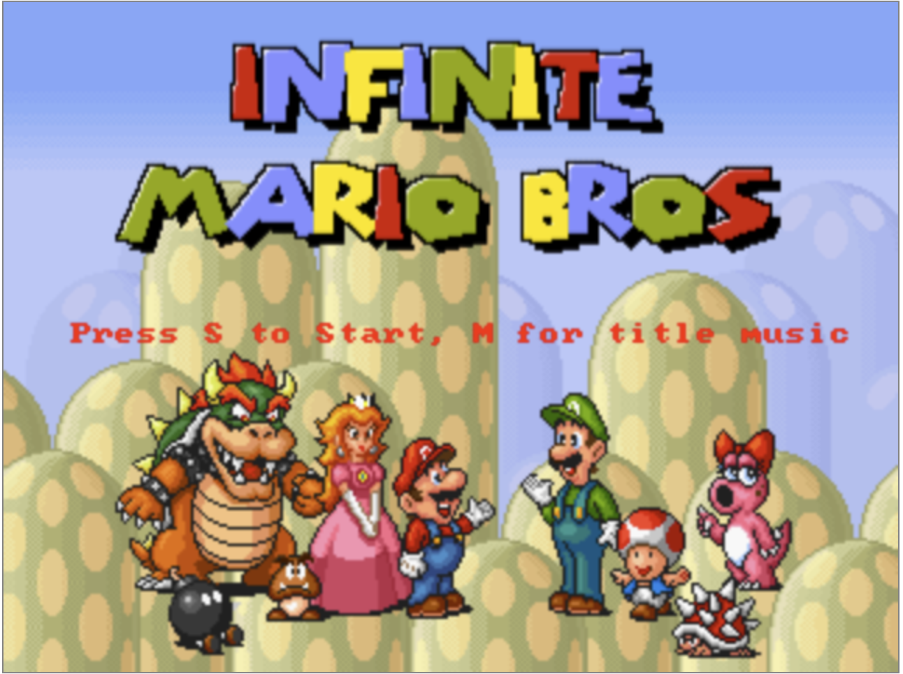
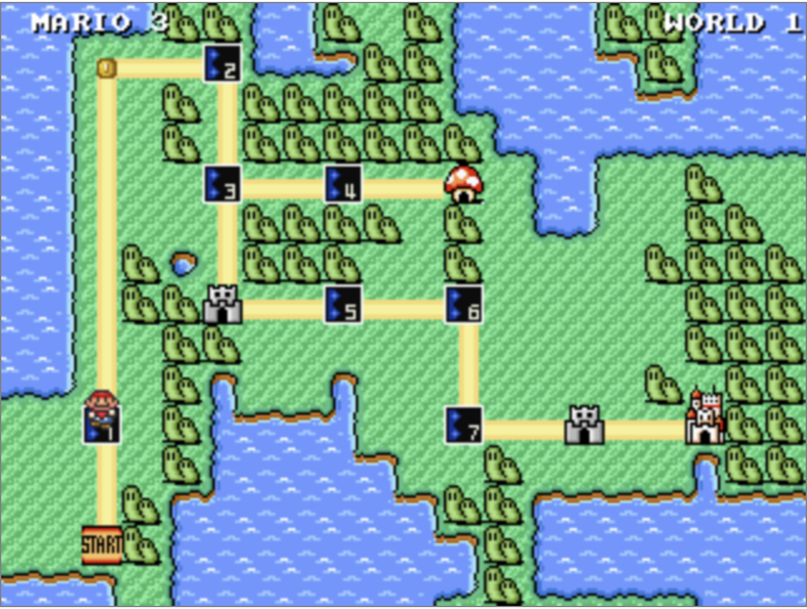
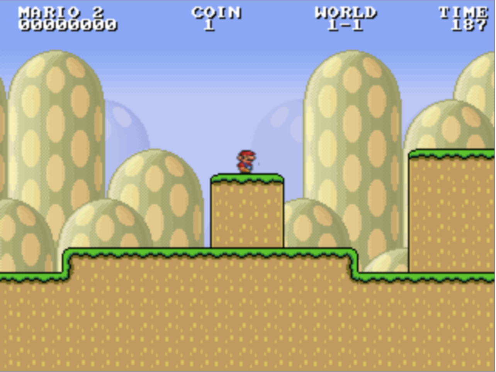

# OTEL Mario HTML5



This is a clone of Infinite Mario, written in JavaScript for web browsers using HTML5.
A good demonstration of what can be accomplished with the Canvas and Audio elements.
Background music now works with most modern browsers.

Ported from the Java version by Notch (Markus Persson).

## OTEL integration is available
[otel-load.js](otel-load.js) file was created to enable this game to emit OTEL traces 
that describe how the page was loaded, user interactions, errors, generally available via
its list of auto-instrumentation libraries.

## Run in docker
You can run this in docker desktop. Use [run.sh](run.sh) script to do that.

## Run locally
Use parcel to build and run it.
```
npx parcel main.html
```

## Game shots


